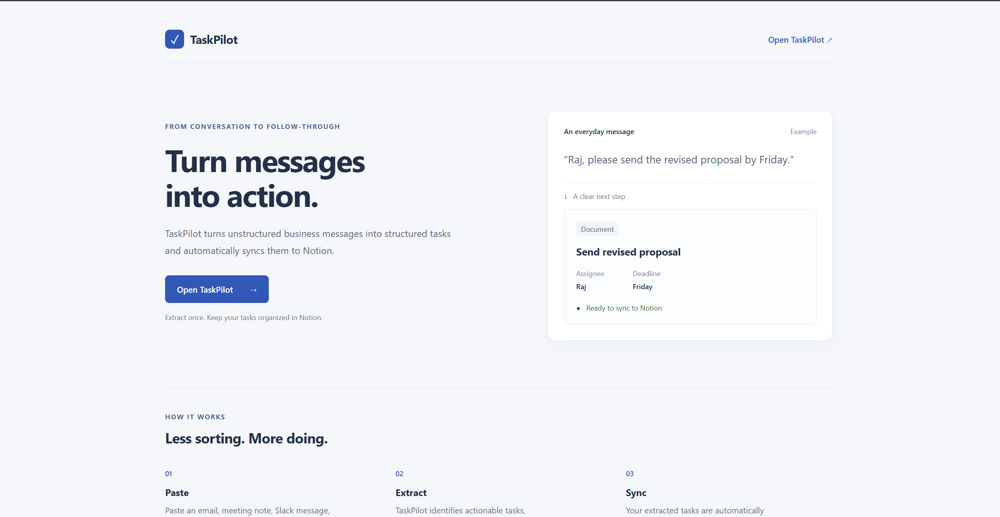
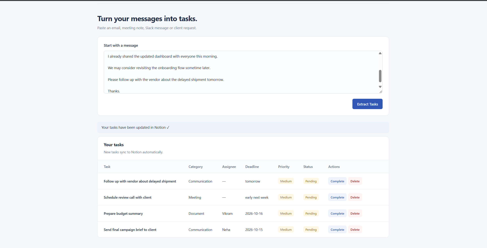
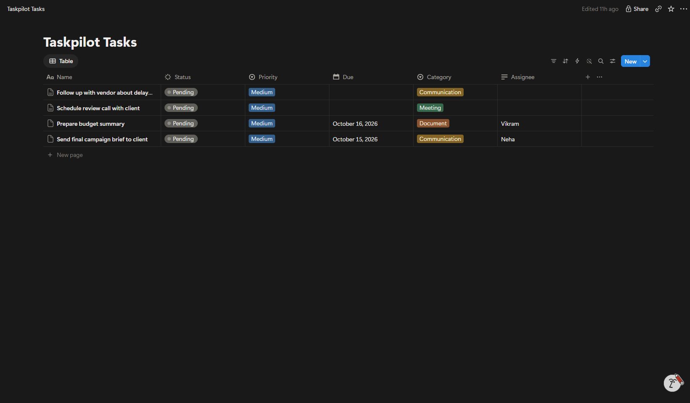

# TaskPilot

TaskPilot turns unstructured business messages into structured action items and automatically syncs them to Notion.

Paste an email, meeting note, Slack message, or client request. TaskPilot uses an instruction-tuned Qwen model to identify actionable tasks, deadlines, assignees, priorities, and categories, stores them locally, and updates a connected Notion task database automatically.

---

## Demo

### Landing page



### AI task extraction



### Automatic Notion sync



---

## Problem

Important action items are often buried inside emails, meeting notes, client messages, and workplace conversations.

Manually reading every message and copying tasks into a task manager is repetitive and makes it easy to miss:

- deadlines
- assigned owners
- follow-ups
- meetings
- documents to prepare
- payment or administrative actions

TaskPilot automates that workflow.

---

## How It Works

```text
Email / Message / Meeting Notes
              |
              v
        Qwen Task Extraction
              |
              v
       Structured Action Items
              |
              v
        SQLite Persistence
              |
              v
      Automatic Notion Sync
```

The user performs one main action:

1. Paste a business message.
2. Click **Extract Tasks**.
3. TaskPilot identifies actionable work.
4. Extracted tasks are stored locally.
5. New tasks are automatically added to the configured Notion database.

If Notion is temporarily unavailable, extracted tasks remain stored locally instead of being lost.

---

## Features

- Extract actionable tasks from unstructured text
- Ignore informational or already-completed statements
- Identify task assignees
- Extract explicit and natural-language deadlines
- Classify task categories
- Estimate task priority
- Persist tasks using SQLite
- Mark tasks complete or reopen them
- Delete local tasks
- Automatically sync newly extracted tasks to Notion
- Prevent repeated Notion synchronization for already-synced tasks
- Preserve vague deadlines without inventing calendar dates
- Graceful handling of AI and Notion failures

---

## AI Extraction

TaskPilot currently uses:

```text
Qwen/Qwen3-4B-Instruct-2507
```

through Hugging Face inference.

The model converts unstructured text into structured task data containing fields such as:

```json
{
  "task": "Prepare the final project summary",
  "assignee": "Ananya",
  "due_date": "2026-10-10",
  "priority": "Medium",
  "category": "Document"
}
```

Model output is parsed and validated by the backend before tasks are persisted or synchronized.

TaskPilot does not blindly treat every sentence as a task. The extraction prompt is designed to distinguish actionable requests from informational statements and already-completed actions.

---

## Deadline Handling

TaskPilot intentionally distinguishes explicit dates from ambiguous natural-language deadlines.

An exact date such as:

```text
2026-10-10
```

can safely populate Notion's `Due` property.

A deadline such as:

```text
next week
before Friday
tomorrow
```

is preserved as text rather than being silently converted into a potentially incorrect date.

This avoids introducing false information into the task system.

---

## Tech Stack

**Backend**

- Python
- FastAPI
- Pydantic

**AI**

- Qwen
- Hugging Face inference

**Storage**

- SQLite

**Integration**

- Notion API

**Frontend**

- HTML
- CSS
- Vanilla JavaScript

---

## Project Structure

```text
task_pilot/
├── app/
│   ├── main.py
│   ├── database.py
│   ├── models.py
│   ├── hf_service.py
│   ├── notion_service.py
│   └── static/
│       ├── index.html
│       ├── app.html
│       ├── styles.css
│       └── app.js
├── docs/
│   ├── taskpilot-landing.png
│   ├── taskpilot-extraction.png
│   └── taskpilot-notion-sync.png
├── requirements.txt
├── .env.example
├── .gitignore
└── README.md
```

The exact internal file structure may vary slightly.

---

## Setup

### 1. Clone the repository

```bash
git clone <your-repository-url>
cd task_pilot
```

### 2. Create a virtual environment

Windows:

```bash
python -m venv .venv
.venv\Scripts\activate
```

macOS / Linux:

```bash
python3 -m venv .venv
source .venv/bin/activate
```

### 3. Install dependencies

```bash
pip install -r requirements.txt
```

### 4. Create `.env`

Copy:

```text
.env.example
```

to:

```text
.env
```

Configure:

```env
HF_TOKEN=your_hugging_face_token
HF_MODEL=Qwen/Qwen3-4B-Instruct-2507

NOTION_API_KEY=your_notion_integration_token
NOTION_DATA_SOURCE_ID=your_notion_data_source_id
```

Never commit `.env`.

---

## Hugging Face Setup

Create a Hugging Face account and generate an access token with the permissions required to use inference.

Add it to:

```env
HF_TOKEN=
```

The model can be changed without modifying application code:

```env
HF_MODEL=Qwen/Qwen3-4B-Instruct-2507
```

---

## Notion Setup

Create a Notion database called:

```text
TaskPilot Tasks
```

Create these properties:

| Property | Type | Values |
|---|---|---|
| Name | Title | — |
| Status | Status | Pending, Completed |
| Priority | Select | Low, Medium, High |
| Due | Date | — |
| Category | Select | Meeting, Follow-up, Document, Communication, Payment, Research, Other |
| Assignee | Text | — |

Create a Notion integration/connection and grant it access to the TaskPilot Tasks database.

Add the integration token to:

```env
NOTION_API_KEY=
```

and the database's data source ID to:

```env
NOTION_DATA_SOURCE_ID=
```

---

## Running TaskPilot

Start the development server:

```bash
python -m uvicorn app.main:app --reload
```

Open:

```text
http://127.0.0.1:8000
```

The application interface is available at:

```text
http://127.0.0.1:8000/app
```

---

## Example

Input:

```text
Hi team,

Neha, please send the final campaign brief to the client by 2026-10-15.

Vikram should prepare the budget summary by 2026-10-16.

Schedule a review call with the client early next week.

I already shared the updated dashboard with everyone this morning.

Please follow up with the vendor about the delayed shipment tomorrow.
```

TaskPilot extracts the actionable items while ignoring the already-completed dashboard update.

Example output:

| Task | Assignee | Deadline | Category |
|---|---|---|---|
| Send final campaign brief | Neha | 2026-10-15 | Communication |
| Prepare budget summary | Vikram | 2026-10-16 | Document |
| Schedule client review call | — | early next week | Meeting |
| Follow up with vendor | — | tomorrow | Communication |

The resulting tasks are then automatically synchronized to Notion.

---

## Design Decisions

### Human-readable deadlines

TaskPilot avoids guessing exact dates when the source text only provides an ambiguous deadline.

### Deterministic workflow around the model

The language model is responsible for understanding unstructured text.

Normal application code handles:

- validation
- persistence
- synchronization
- duplicate-sync prevention
- completion state
- deletion
- error handling

### Failure isolation

Notion synchronization is downstream of extraction.

If Notion fails, successfully extracted tasks are still retained locally.

---

## Future Work

TaskPilot is intentionally kept small for the current MVP.

Potential extensions include:

- Gmail integration for importing emails directly
- Slack integration for extracting tasks from workspace messages
- Microsoft Teams integration
- Google Calendar integration for meeting-related tasks
- OAuth-based Notion connection for multiple users
- User accounts and per-user workspaces
- Multiple Notion databases and configurable property mappings
- Automatic normalization of relative deadlines using user timezone and confirmation
- Two-way synchronization between TaskPilot and Notion
- Retry queues for failed external synchronization
- Background processing for large message batches
- Task editing before synchronization
- Duplicate task detection across multiple messages
- More configurable categories and priority rules
- Additional task platforms such as Linear, Asana, Jira, and Todoist
- Docker deployment
- Automated API and integration tests
- Monitoring and structured observability for production deployment

---

## Security

Secrets are loaded only from environment variables.

Do not commit:

- Hugging Face tokens
- Notion integration tokens
- `.env`
- local SQLite databases
- virtual environments

The repository contains `.env.example` only as a configuration template.

---

## Status

TaskPilot is currently an MVP focused on one workflow:

**Unstructured message → structured tasks → automatic Notion synchronization.**
